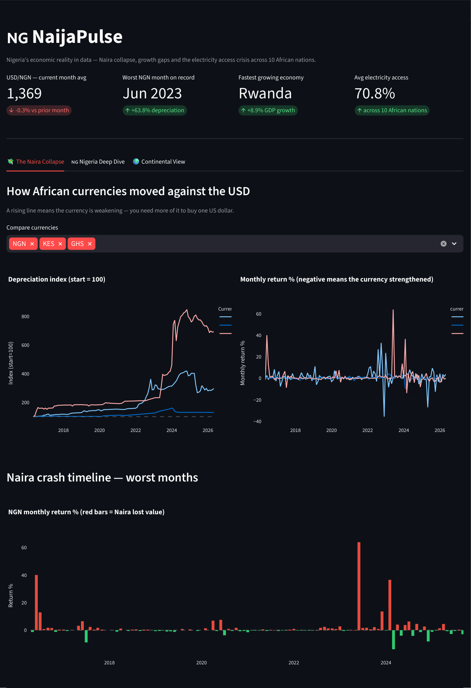
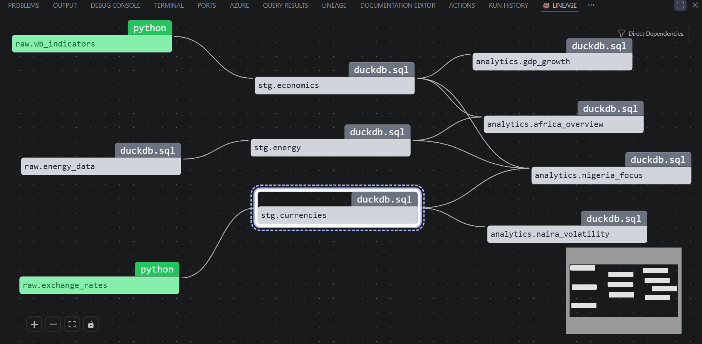

# 🇳🇬 NaijaPulse

> Nigeria's economic reality in data — Naira collapse, growth gaps, and the
> electricity access crisis across 10 African nations.

Built with [Bruin](https://getbruin.com) · Submitted for the
[Bruin Community Competition](https://getbruin.com/competition)

---

## The Story

Nigeria is Africa's largest economy. It is also home to one of the world's
most volatile currencies, a persistent electricity access gap, and an
inflation rate that has consistently outpaced GDP growth. Yet most data tools
treat African economies as an afterthought — a footnote in a global dashboard
built for US and European datasets.

NaijaPulse is a production-grade data pipeline that puts Nigeria at the
centre. It ingests live data from three public sources, transforms it through
a clean layered architecture, and surfaces it in an interactive dashboard that
tells the story numbers alone cannot.

---

## Dashboard



Three focused tabs:

- **💸 The Naira Collapse:** depreciation index, monthly crash timeline and
  volatility comparison across NGN, KES, ZAR, GHS and EGP
- **🇳🇬 Nigeria Deep Dive:** GDP growth vs Naira rate on dual axis, inflation
  trend and electricity access over time
- **🌍 Continental View:** GDP growth ranking, electricity access gap and a
  growth vs inflation pressureS map across 10 African nations

---

## Pipeline Architecture

```
Sources                  Raw                   Staging               Analytics
─────────────────────────────────────────────────────────────────────────────────
Yahoo Finance (yfinance) → raw.exchange_rates → stg.currencies   → naira_volatility
World Bank Open Data     → raw.wb_indicators  → stg.economics    → gdp_growth
Our World in Data (CSV)  → raw.energy_data    → stg.energy       → nigeria_focus
                                                                  → africa_overview
```


**9 assets · 3 data sources · 5 quality checks · fully local with DuckDB**

All assets are orchestrated by Bruin with explicit `depends:` declarations,
materialized as DuckDB tables, and validated with column-level quality checks.

---

## Data Sources

| Source | Ingestion method | What it provides |
|--------|-----------------|------------------|
| [Yahoo Finance](https://finance.yahoo.com) | Python asset via `yfinance` | Daily USD rates for NGN, KES, ZAR, GHS, EGP — 10 years |
| [World Bank Open Data](https://data.worldbank.org) | Python asset via REST API | GDP growth, inflation, FDI, unemployment, electricity access |
| [Our World in Data](https://github.com/owid/energy-data) | DuckDB `read_csv` from URL | Renewable share, fossil fuel share, carbon intensity |

---

## Countries Tracked

Nigeria · Kenya · South Africa · Ghana · Egypt · Ethiopia ·
Tanzania · Uganda · Rwanda · Senegal

---

## Key Analytical Models

### `analytics.naira_volatility`
Monthly currency performance for all five tracked currencies. Captures average
rate, high/low range, monthly return percentage and 30-day rolling volatility.
The Naira's structural depreciation events which includes the 2023 float and the parallel
market collapse are clearly visible in the `monthly_return_pct` column.

### `analytics.nigeria_focus`
A unified year-by-year view of Nigeria joining currency history,
macroeconomic indicators and energy data into a single table. The dual-axis
GDP vs Naira chart built from this model tells the clearest story in the
dashboard: currency depreciation and GDP growth are structurally decoupled.

### `analytics.gdp_growth`
Annual GDP growth ranked across all 10 countries with a 3-year rolling
average, paired with inflation and FDI for multi-dimensional comparison.

### `analytics.africa_overview`
The continental view — energy transition status mapped against economic
indicators for every tracked country and year.

---

## Bruin Features Used

| Feature | Where |
|---------|-------|
| **Python assets** | Live API ingestion with `materialize()` for Yahoo Finance and World Bank |
| **DuckDB SQL assets** | `read_csv` direct from public GitHub URL for energy data |
| **Asset dependencies** | `depends:` wires the full DAG — Bruin runs assets in correct order automatically |
| **Materialization** | All 9 models persisted as DuckDB tables |
| **Quality checks** | `not_null` and `positive` enforced on critical staging columns |
| **Column descriptions** | Full metadata on every staging model |
| **Asset tags** | Consistent tagging across raw / staging / analytics layers |

---

## Design Decisions

**Why Yahoo Finance over Frankfurter?**
Frankfurter only covers major global currencies — NGN, KES, GHS and EGP are
not included. Yahoo Finance forex tickers (`USDNGN=X`) provide 4+ years of
daily historical data for all African currencies at no cost.

**Why DuckDB over BigQuery?**
The entire pipeline runs locally with zero infrastructure. DuckDB's
`read_csv` can query a remote CSV file directly from a GitHub URL without
downloading it — the energy data asset is a single SQL file with no moving
parts.

**Why a depreciation index rather than raw rates?**
NGN trades at ~1,600 per dollar while KES trades at ~130. Plotting raw rates
makes comparison impossible. Normalising each currency to 100 at the start
of the data period reveals the relative pace of depreciation clearly on a
single chart.

**Single-worker pipeline**
DuckDB allows only one writer at a time. Running `bruin run` with
`--workers 1` (aliased as `bruin-run`) prevents file lock conflicts without
any other configuration changes.

---

## Setup

**Requirements:** WSL2 / Linux / macOS · Python 3.12+ · [uv](https://docs.astral.sh/uv/)

```bash
# Install Bruin
curl -LsSf https://getbruin.com/install/cli | sh

# Clone the repo
git clone https://github.com/mekings1/which-way-naija
cd which-way-naija

# Install Python dependencies
uv add yfinance pandas requests streamlit plotly duckdb
or uv sync # to recreate exact versions

# Add a single-worker alias to avoid DuckDB file lock
echo "alias bruin-run='bruin run --workers 1'" >> ~/.bashrc
source ~/.bashrc

# Run the full pipeline
bruin-run naijaPulse

# Launch the dashboard
cd naijaPulse
uv run streamlit run dashboard.py
```

---

## Project Structure

```
bruin/
├── naijaPulse/
│   ├── pipeline.yml  
│   ├── dashboard.py                    # Streamlit dashboard
│   └── assets/
│       ├── raw/
│       │   ├── exchange_rates.py       # Yahoo Finance — 5 African currency pairs
│       │   ├── wb_indicators.py        # World Bank API — 5 macroeconomic indicators
│       │   └── energy_data.sql         # OWID CSV via DuckDB read_csv
│       ├── staging/
│       │   ├── stg_currencies.sql      # Volatility calc + GHS normalisation + QC
│       │   ├── stg_economics.sql       # Wide pivot + quality checks
│       │   └── stg_energy.sql          # Filter + energy profile classification
│       └── analytics/
│           ├── naira_volatility.sql    # Monthly currency performance
│           ├── gdp_growth.sql          # GDP trends with rolling avg + ranking
│           ├── nigeria_focus.sql       # Nigeria deep-dive — 3-source join
│           └── africa_overview.sql     # Continental energy + economics overview
├── .bruin.yml                          # DuckDB connection config
├── pyproject.toml                      # uv project config
├── .python-version                     # python version file
└── uv.lock                             # uv lockfile

```
---

## Sample Queries

```sql
-- Which months saw the biggest Naira crashes?
SELECT month, avg_rate, monthly_return_pct
FROM analytics.naira_volatility
WHERE currency = 'NGN'
ORDER BY monthly_return_pct DESC
LIMIT 10;

-- How does Nigeria's GDP growth compare to its inflation rate?
SELECT year, gdp_growth, inflation, avg_usd_ngn
FROM analytics.nigeria_focus
ORDER BY year;

-- Which country grew fastest each year?
SELECT year, country_name, gdp_growth
FROM analytics.gdp_growth
WHERE growth_rank = 1
ORDER BY year;

-- Electricity access gap across Africa
SELECT country_name, electricity_access
FROM analytics.gdp_growth
WHERE year = (
    SELECT MAX(year) FROM analytics.gdp_growth
    WHERE electricity_access IS NOT NULL
)
ORDER BY electricity_access DESC;
```

---

## What I Learned


Building NaijaPulse with Bruin changed how I think about data pipelines.
The `depends:` system means I never have to think about execution order —
Bruin resolves the DAG automatically. Orchestration is already embedded.

Quality checks across layers are very helpful and excellent for catching what you
*expect* to go wrong but who checks the source? A value can pass every
check and still be wrong because the underlying data is just wrong. I always
assumed that fetching from an API, unlike reading flat files, meant close to
100% accuracy. That assumption didn't survive contact with the USDGHS Yahoo
Finance ticker, where March 31 2020 recorded 573 instead of 5.73. I only
investigated because of a visible spike in the dashboard and further
research confirmed the error originated at the source, not in the pipeline.

Most importantly: there is no shortage of African data. Frankfurter,
World Bank, Our World in Data, Yahoo Finance — all free, all public, all
telling a story that deserves more pipelines pointed at it.

---

*Powered by Bruin, DuckDB, and public data*
